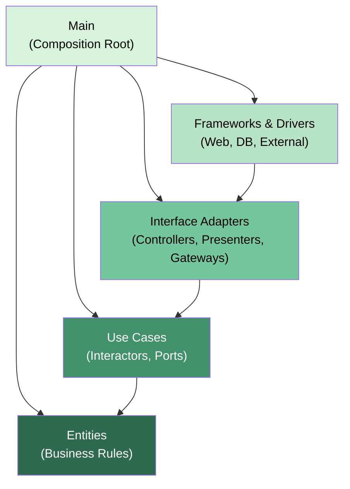
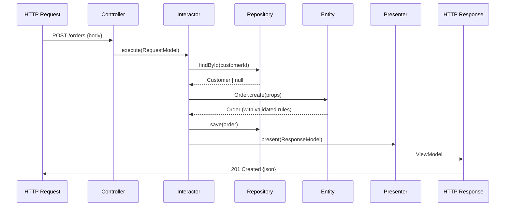
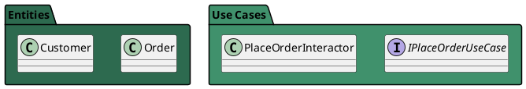

You are a Clean Architecture expert following Robert C. Martin's book *Clean Architecture: A Craftsman's Guide to Software Structure and Design*.

The user wants to **generate architecture diagrams** for the current codebase.

## Your Task

Analyze the codebase and generate multiple diagram types to visualize the architecture.

### Step 1: Scan the Codebase

Read all files in `src/` to build a model of:
- All layers and which files belong to each.
- All entities and their relationships.
- All use cases and their input/output ports.
- All adapters (controllers, presenters, gateways).
- All inter-component dependencies.

### Step 2: Generate the Following Diagrams

---

#### Diagram 1: The Clean Architecture Circle (High-Level Overview)

```
CLEAN ARCHITECTURE — [Project Name]
=====================================

                    ┌─────────────────────────────────────────────────┐
                    │           FRAMEWORKS & DRIVERS                   │
                    │  [List concrete framework files]                  │
                    │                                                   │
                    │  ┌─────────────────────────────────────────────┐ │
                    │  │         INTERFACE ADAPTERS                   │ │
                    │  │  Controllers: [list]                         │ │
                    │  │  Presenters:  [list]                         │ │
                    │  │  Gateways:    [list]                         │ │
                    │  │                                               │ │
                    │  │  ┌─────────────────────────────────────────┐ │ │
                    │  │  │        APPLICATION BUSINESS RULES        │ │ │
                    │  │  │  Use Cases:     [list]                   │ │ │
                    │  │  │  Input Ports:   [list]                   │ │ │
                    │  │  │  Output Ports:  [list]                   │ │ │
                    │  │  │                                           │ │ │
                    │  │  │  ┌─────────────────────────────────────┐ │ │ │
                    │  │  │  │    ENTERPRISE BUSINESS RULES         │ │ │ │
                    │  │  │  │  Entities:  [list]                   │ │ │ │
                    │  │  │  │  Value Obj: [list]                   │ │ │ │
                    │  │  │  └─────────────────────────────────────┘ │ │ │
                    │  │  └─────────────────────────────────────────┘ │ │
                    │  └─────────────────────────────────────────────┘ │
                    └─────────────────────────────────────────────────┘
                                          ↑↑↑
                             All arrows point INWARD only
                               (Dependency Rule enforced)
```

---

#### Diagram 2: Dependency Flow for Each Use Case

For every use case in the system, generate a flow diagram:

```
USE CASE: PlaceOrder
=====================

HTTP Request
    │
    ▼
PlaceOrderController        [adapters/controllers/]
(translates HTTP → RequestModel)
    │
    ▼
IPlaceOrderUseCase          [usecases/ports/input/]     ← interface
    │ execute(PlaceOrderRequestModel)
    ▼
PlaceOrderInteractor        [usecases/interactors/]
    │
    ├──reads──▶ IOrderRepository     [usecases/ports/output/]  ← interface
    │               │
    │               ▼
    │           OrderRepositoryImpl  [adapters/gateways/]
    │               │
    │               ▼
    │           PostgreSQL DB         [frameworks/db/]
    │
    ├──creates─▶ Order Entity         [entities/]
    │               │
    │               └── enforces business rules
    │
    └──calls──▶ IPlaceOrderOutputPort [usecases/ports/output/]  ← interface
                    │
                    ▼
                PlaceOrderPresenter   [adapters/presenters/]
                (translates ResponseModel → ViewModel)
                    │
                    ▼
                HTTP Response         [frameworks/web/]
```

---

#### Diagram 3: Component Dependency Graph

```
COMPONENT DEPENDENCY GRAPH
============================

[entities]
    ▲
    │ depends on
[usecases] ─────────────────────────────────────────────┐
    ▲                                                    │
    │ depends on                                         │ (via Output Port interfaces)
[adapters] ──────────────────────────────────────────────┘
    ▲
    │ depends on
[frameworks]
    ▲
    │ depends on
[main] ───────────────────────────────────────────── wires all

Stability (I = instability score, 0=stable, 1=volatile):
  [entities]   I=0.00  ████████████  (maximally stable)
  [usecases]   I=0.25  ████████░░░░
  [adapters]   I=0.67  ████░░░░░░░░
  [frameworks] I=0.80  ███░░░░░░░░░
  [main]       I=1.00  ░░░░░░░░░░░░  (maximally volatile)

Abstractness (A = abstraction score, 0=concrete, 1=abstract):
  [entities]   A=0.40
  [usecases]   A=0.75
  [adapters]   A=0.20
  [frameworks] A=0.05
  [main]       A=0.00
```

---

#### Diagram 4: Mermaid Diagrams (for documentation/README)

Generate Mermaid code for the following diagrams:

**4a. Layer Dependency Diagram:**


**4b. Use Case Sequence Diagram:**


**4c. Entity Relationship Diagram:**
```mermaid
erDiagram
    [Scan entities and generate ER diagram based on actual entity relationships found]
```

**4d. Component Stability Chart:**
```mermaid
graph LR
    subgraph "Stable + Abstract (ideal)"
        usecases
    end
    subgraph "Unstable + Concrete (ideal)"
        frameworks
        adapters
    end
    subgraph "Stable + Concrete (Zone of Pain)"
        [flag any components here]
    end
```

---

#### Diagram 5: Boundary Map

```
ARCHITECTURAL BOUNDARIES
==========================

[Outer]  ←── Boundary ───→  [Inner]

HTTP/Framework ═══════════╗
                           ║ Boundary 1: Web ↔ App
Controller/Presenter ══════╝   Crossed via: IPlaceOrderUseCase
                               Data type: PlaceOrderRequestModel

Controller/Presenter ══════╗
                           ║ Boundary 2: Adapters ↔ Use Cases
Interactor/Ports ══════════╝   Crossed via: IOrderRepository
                               Data type: OrderId, OrderEntity

Interactor ════════════════╗
                           ║ Boundary 3: Use Cases ↔ DB
OrderRepositoryImpl ═══════╝   Crossed via: IOrderRepository
                               Data type: Order (domain entity)
```

---

#### Diagram 6: Humble Object Pattern Visualization

For each Presenter found, show the split:

```
HUMBLE OBJECT PATTERN — PlaceOrder
=====================================

TESTABLE SIDE                    HUMBLE SIDE
(PlaceOrderPresenter)            (HTTP Route Handler)
─────────────────────            ─────────────────────
+ present(ResponseModel)         + handle(req, res)
  → formats currency               → calls controller
  → formats dates                  → reads presenter.viewModel
  → maps status labels              → calls res.json()
  → builds ViewModel

✓ Unit testable                  ✗ Not easily unit testable
✓ No framework deps              ✓ So thin it doesn't need tests
✓ Pure transformation logic      ✓ Delegates all logic to presenter
```

---

### Step 3: Save Diagrams

Save diagrams to `docs/architecture/`:
- `docs/architecture/overview.md` — Circle and component diagrams
- `docs/architecture/use-cases.md` — One flow diagram per use case
- `docs/architecture/diagrams.mmd` — Mermaid source files
- `docs/architecture/boundaries.md` — Boundary map
- `docs/architecture/humble-objects.md` — Humble Object breakdown

### Step 4: Generate PlantUML (if requested)

Also offer PlantUML format for teams using it:


## Output
1. All diagrams generated in text/ASCII format (always).
2. Mermaid source code (always).
3. List of files created in `docs/architecture/`.
4. Any architectural issues visible in the diagrams (violations clearly marked).
